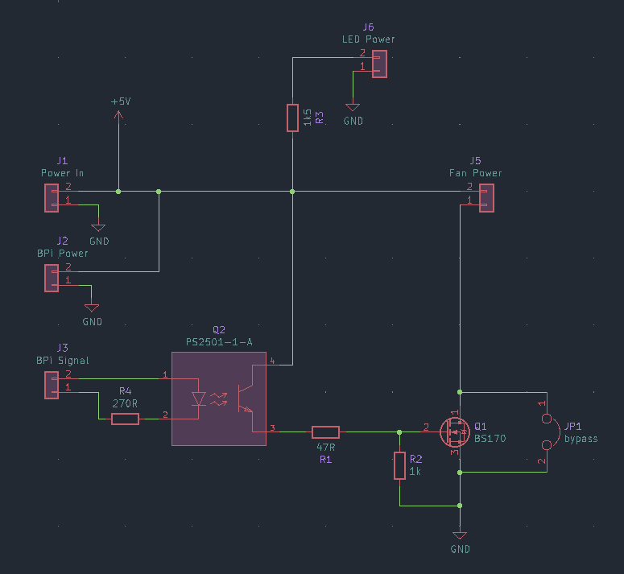
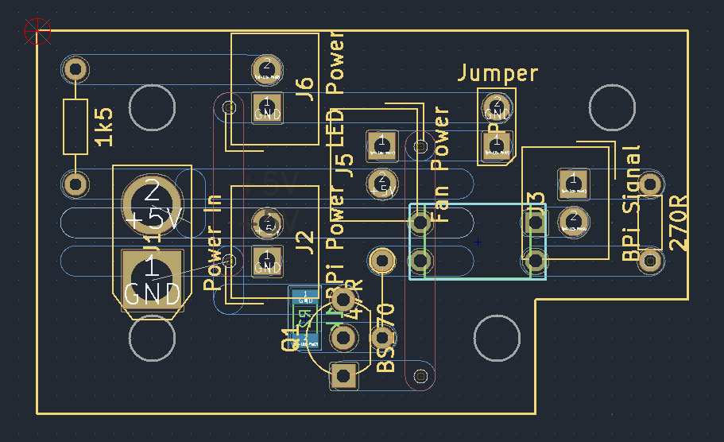
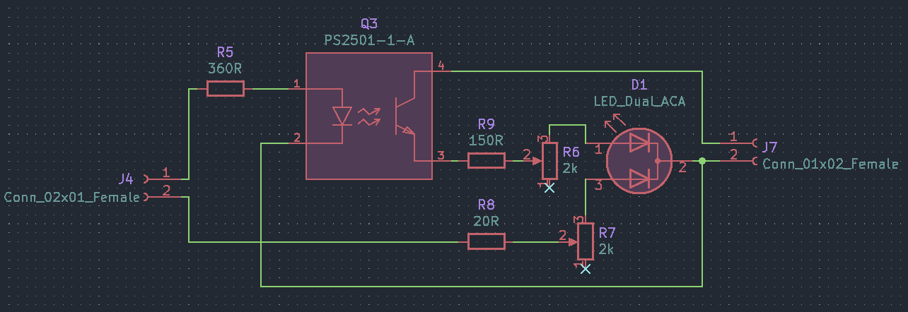
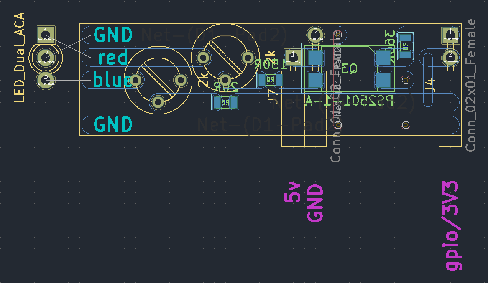

# Single Board Computer Power and LED Status Boards
KiCad files for a couple of PCBs that are useful with single board computers, to be built on stripboard.

This has been developed in the context of Banana Pi M2 Ultra and M3 devices, but will apply to similar devices. Obviously not all single board computers will have batteries, so the status LED may be less useful in many cases. The GPIO pin arrangement should be identical for many devices, but it would be worth confirming the pin numbers specified here are appropriate.

## Power Distribution Board
As well as splitting power to various components, accept a PWM signal from the device's GPIO (via an optocoupler) to switch a MOSFET and control a fan's speed.

The PWM bypass jumper can be omitted if you're confident the device's PWM function works. Conversely, the MOSFET and optocoupler can be omitted if there's no fan or running a fan at full speed whenever this board is powered is acceptable.





The `LED power` connector on this board will indicate whenever this board is powered, but is superseded by the LED status board for more advanced signalling of the power status.

### Software
I'm currently not confident my SBC's PWM function works. For the time being it's easiest to just use the GPIO to switch the fan all the way on or off, with no speed control.

The advantage of this over using the bypass jumper is that the fan only runs when the BPi is switched on. The bypass jumper runs the fan whenever the enclosure is connected to power, regardless of whether the BPi itself is on.

Using GPIO pin 13 (BCM 277) is convenient because there's an adjacent GND pin, so both connections are made with a single 1x2 jumper housing.

Configuring systemd to start the fan early in the init process looks like this:

```sh
sudo sh -c "cat << EOF > /etc/systemd/system/cooling-fan.service
[Unit]
Description=Enable cooling fan
Before=basic.target
After=local-fs.target sysinit.target
DefaultDependencies=no

[Service]
Type=oneshot
ExecStart=gpioset 0 277=1
ExecStop=gpioset 0 277=0
RemainAfterExit=yes

[Install]
WantedBy=basic.target
EOF"

sudo systemctl daemon-reload
sudo systemctl enable cooling-fan.service
```

## LED Status Board
A bi-colour LED connected to the GPIO can give useful status information.

The 5V pins on the GPIO are always powered when external power is connected, but the 3V3 pins are only powered when the device is turned on. The 3V3 pins are powered whether running off external power or battery. Using an AND gate (in this case an optocoupler) results in a LED that is only lit when the BPi is on and running on external power (and off when running on battery).

A general GPIO pin can be set high by systemd once booted, giving a "booted/ready" indication by directly powering the other colour in the LED.

It's convenient to use GPIO headers pins 4 (5V), 6 (GND), 17 (3V3) and 18 (GPIO 24, BCM 250). This leaves the I2C pins free and allows a PCB with female connectors to plug directly into the GPIO header with enough spacing between the pins for a robust connection.





Using a red/blue LED, this gives a unique identification for all scenarios except booting from battery:

| State | external | battery
| --- | --- | ---
| off | - | -
| booting | red | -
| booted | purple | blue

### Resistor selection
The values for resistors in these diagrams are chosen for the specific LED colour they'll be powering. The fixed series resistors before the trimpots are for protection, to prevent accidentally blowing LEDs or something on the SBC by winding a trimpot all the way to zero. If you're not using a blue LED on that channel, the 20ohm value in the schematic may be too low for that purpose.

The trimpots are solely for brightness adjustment and balancing the two colours when both are lit. They can be omitted in favour of fixed resistors if that's not a concern.

### Software
To make the boot LED service start after everything else has started, create a target that is reached after multi-user.target and then start the service at that point.

#### /etc/systemd/system/booted.target
```ini
[Unit]
Description=System is booted and ready (for toggling status LED)
Requires=multi-user.target
After=multi-user.target
AllowIsolate=yes
```

#### /etc/systemd/system/boot-led.service
```ini
[Unit]
Description='booted' status indicator LED
After=multi-user.target

[Service]
Type=oneshot
ExecStart=gpioset 0 250=1
ExecStop=gpioset 0 250=0
RemainAfterExit=yes

[Install]
WantedBy=booted.target
```

Finally, to enable the target and unit:
```sh
sudo mkdir /etc/systemd/system/booted.target.wants
sudo ln -s /etc/systemd/system/boot-led.service /etc/systemd/system/booted.target.wants/boot-led.service
sudo systemctl daemon-reload
sudo systemctl enable boot-led
sudo systemctl set-default booted.target
```

#### /usr/bin/bootled.sh
A shell script can also toggle the 'booted' LED:
```sh
#! /bin/sh

GPIO_bus="0"
GPIO_pin="250"

indication="$(echo ${1:-on} | tr '[:upper:]' '[:lower:]')"

case ${indication} in
        "on")
                gpioset ${GPIO_bus} ${GPIO_pin}=1
                ;;
        "off")
                gpioset ${GPIO_bus} ${GPIO_pin}=0
                ;;
        *)
                echo "Error: unknown state '${indication}'. Accepts 'on' or 'off'."
                exit 1
                ;;
esac
```

## Links
*   <https://github.com/moonbuggy/sbc-os-images>
